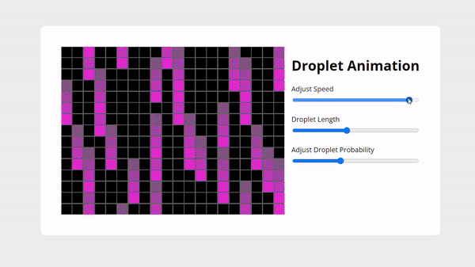

# Droplet Animation

Droplet Animation using JavaScript 2d matrix
with variable
1. Speed.
2. Droplet Length.
3. Probability of Droplet
---

[Live Try](https://rahulsahofficial.github.io/drop-animation/)
